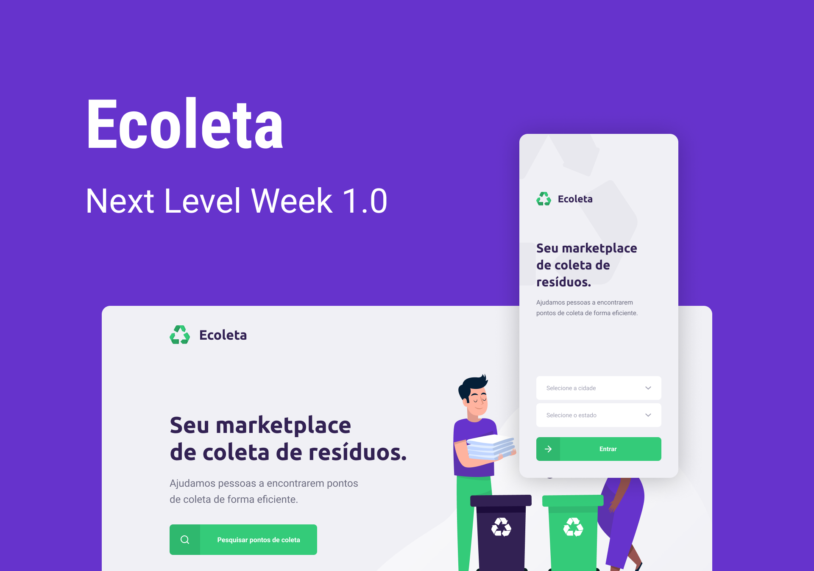

<h3 align="center">
    
     
     
</h3>

<!-- 

    Projeto desenvolvido durante as aulas da NLW (Next Level Week), disponibilizadas pela <a href="https://rocketseat.com.br"><a/>

 -->

## Sobre o Projeto

    Uma aplicação de cadastro e busca de pontos de coleta para materiais recicláveis.

    
    
    (O layout está disponível no **[Figma](https://www.figma.com/file/1SxgOMojOB2zYT0Mdk28lB/)**)

<!-- ## O que é NLW? -->

## Tecnologias

O projeto foi desenvolvido utilizando as seguintes tecnologias:

.[TypeScript](https://www.typescriptlang.org/)
.[Node.js](https://nodejs.org/en/)
.[ReactJS](https://reactjs.org/)
.[React Native](https://reactnative.dev/)

